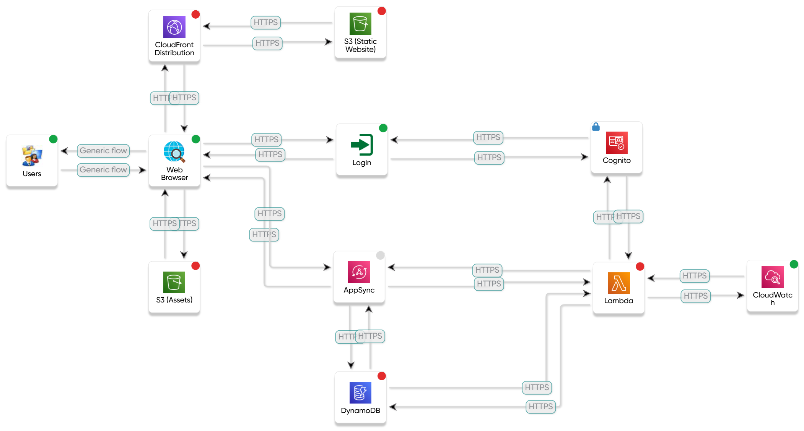
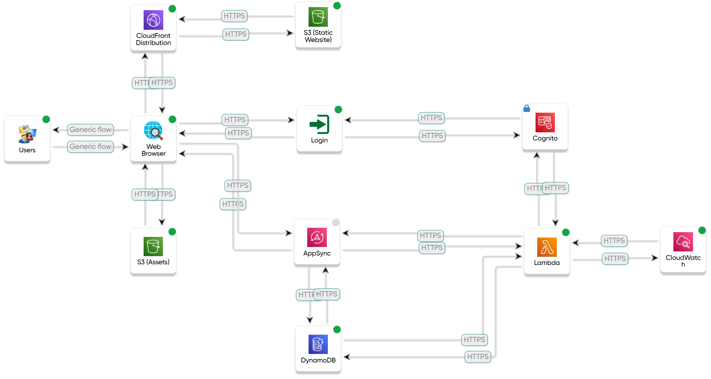

# README – Cloud-Native Web App – Security System Design

In questo progetto sono state apportate migliorie ad alcune funzionalità della web app presente nella repository [**Cloud-Native Web App – Software Architecture Design**](https://github.com/FrancyScogna/cloud-native-web-app-sad).
Inoltre, sono stati analizzati e applicati requisiti di sicurezza seguendo le linee guida NIST, utilizzando la piattaforma online **ThreatModeler** per la definizione e la gestione del modello di minacce (threat model).

## Requisiti di Sicurezza Applicati – Modello STRIDE

La seguente tabella mostra l'associazione tra le categorie del modello **STRIDE** e i controlli di sicurezza NIST implementati:

| **STRIDE**                 | **Controlli di Sicurezza (NIST)**                                                                 |
|---------------------------|---------------------------------------------------------------------------------------------------|
| **Spoofing**              | IA-2, IA-4, IA-5, IA-11, IA-12, AC-2, AC-7, AC-8, AC-12, SC-7, SC-17, SC-18, SC-23                |
| **Tampering**             | AC-3, AC-5, AC-17, SC-5, SC-7, SC-8, SC-12, SC-13, SC-18, SC-23, AU-4, AU-8, AU-9, AU-12           |
| **Repudiation**           | IA-2, IA-4, IA-5, IA-11, AC-2, AC-5, AC-8, SC-17, AU-2, AU-3, AU-4, AU-8, AU-9, AU-11, AU-12       |
| **Information Disclosure**| IA-5, IA-6, AC-2, AC-3, AC-17, SC-8, SC-12, SC-13, SC-23, AU-7, AU-11                              |
| **Denial of Service**     | SC-5, SC-7                                                                                         |
| **Elevation of Privilege**| AC-3, AC-6, SC-2                                                                                   |

## Documentazione

La documentazione è composta da una presentazione PowerPoint che illustra sia gli aspetti architetturali dell'applicazione sia quelli relativi alla sicurezza.  
Nelle slide finali sono riportati i controlli NIST adottati e l’analisi del modello di minacce.  
**File:** `SSD_Project_Presentazione.pptx`

## Tools Utilizzati

| **FRONT END**                                             | **TOOLS**                          |
| --------------------------------------------------------- | ---------------------------------- |
| _FRAMEWORK_                                               | ReactJs                            |
| _LANGUAGE_                                                | HTML, CSS, JSX                     |
| **BACK END**                                              |                                    |
| _FRAMEWORK_                                               | Serverless Framework               |
| _LANGUAGE_                                                | JS, MJS                            |
| _TESTING_                                                 | Jest, Grafana k6                   |
| _CLOUD SERVICES_                                          | Amazon Web Services                |
| **TOOLS PER IL SUPPORTO ALLA REALIZZAZIONE DEL SOFTWARE** |                                    |
| _CODE_                                                    | Visual Studio Code                 |
| _UML DESIGN_                                              | Visual Paradigm                    |
| _SCRUM SUPPORT_                                           | GitLab                             |
| _WEB HOSTING_                                             | Amazon S3                          |
| _THREAT MODELING_                                         | ThreatModeler (piattaforma online) |

## Threat Model

### Prima della mitigazione

### Dopo la mitigazione

## Autori

- Francesco Scognamiglio  
- Felice Micillo
